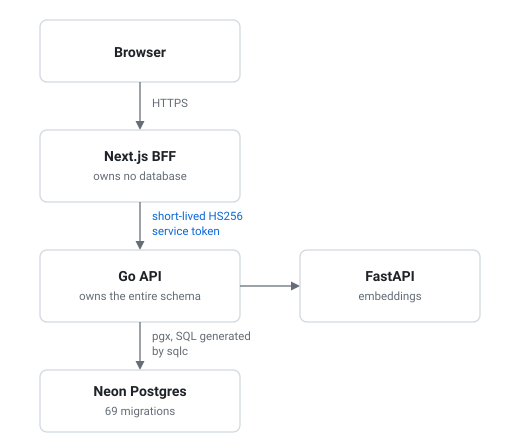

# Chris Kim

Senior backend engineer, seven years in. I build identity and access systems
for other engineers and API consumers.

At Capital One I work on IAM: access enforcement across 50,000+ employees and
4,000+ AWS accounts, OAuth and JWT service-to-service auth, and secrets
rotation through Vault. Earlier, data retention, and account ingestion, where
a Go rewrite of a Java service held 2.4k req/s.

Go is my primary language. Outside work I build the toolchain for whatever
workflow annoys me.

## Projects

| Project | What it is | Stack |
|---|---|---|
| **job-search** *(private)* | Multi-tenant job platform. 69 migrations, 150 test files | Go, Next.js, Neon |
| [**seakim-design-system**](https://github.com/christophercuongkim/seakim-design-system) | One rule set, proven by a React binding and a Flutter binding. 38 decision records | Dart, TypeScript |
| [**studio**](https://github.com/christophercuongkim/studio) | A whole video pipeline in one static Go binary. Four third-party modules, no framework, no database | Go |
| [**fantasy-hub**](https://github.com/christophercuongkim/fantasy-hub) | NFL analytics. Projections, simulation, hot and cold storage tiers | Python, DuckDB |
| **Juntio** *(private)* | Group trip planning on iOS, Android, and web | Flutter, Go |
| [**dotfiles**](https://github.com/christophercuongkim/dotfiles) | NixOS on a Framework 13, flake-parts dendritic pattern | Nix |
| [**zmk-config**](https://github.com/christophercuongkim/zmk-config) | Split Corne firmware. Five layers, custom hold-tap behaviors | Devicetree |

Running at [juntio.io](https://juntio.io) and
[fantasy.chriskim.cloud](https://fantasy.chriskim.cloud).

## How job-search is wired

The web layer holds no schema and no database credentials. It signs a token
and asks.

## How I work

- No ORM in Go. Hand-written SQL with sqlc codegen, and `sqlc diff` in CI so
  generated code cannot drift from the schema.
- Twelve hand-written Nix flakes. Every repo opens with `direnv allow`.
- Dokploy on a VPS. Deploy webhooks answer only inside a Tailscale tailnet,
  which GitHub Actions joins as an ephemeral, ACL-tagged node.
- A `CONTEXT.md` per project defining its domain terms, each with the words
  not to use for it.
- CI gates that prove themselves. The design system's conformance self-test
  checks every rule fires on a bad fixture and stays quiet on a good one.
- Comments carry the number that forced the decision.

## Background

M.S. Cybersecurity at NYU, in progress. B.S. Computer Science, Cal Poly San
Luis Obispo. AWS Solutions Architect Associate.

## Now

Looking for senior backend and platform roles where another engineer or an API
consumer is the customer. Remote within the US, or on-site in San Francisco.

Reach me on [LinkedIn](https://www.linkedin.com/in/christophercuong/).
